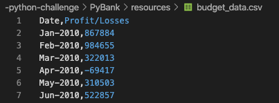

# -python-challenge
###### by Libardo Lambrano

### Background

Using python to complete two real world analytics challenges [PyBank](#pybank) and [PyPoll](#pypoll).

#### PyBank 

Creating a Python script for analyzing the financial records of a company. 

> **Given**  

A set of financial data `budget_data.csv`. The dataset contains two columns: Date and Profit/Losses.

> **Tasks**

* Calculate total number of months included in the dataset
* Net total amount of "Profit/Losses" over the entire period
* Average of the changes in "Profit/Losses" over the entire period
* Greatest increase in profits (date and amount) over the entire period
* Greatest decrease in losses (date and amount) over the entire period

> **Solution** 

Import modules, read source file and skip header 

    import os
    import csv

    file = os.path.join('resources', 'budget_data.csv')

    with open(file) as f:
        reader = csv.reader(f, delimiter=',')
        header_row = next(reader)

Generate lists from csv columns and set `counter` for rows at `1`

    months = [] # empty list to store
    profit_loss = [] # empty list to store
    change = []
    c = 1 # counter start

Loop through rows to append data to lists

    for row in reader: 
        months.append(row[0]) # add all months column 0 
        profit_loss.append(int(row[1])) 

### Calculations to answer the following questions 

* Total number of months included in the dataset

        total_months = len(months)

* Total amount of "Profit/Losses" over the entire period

            for c in range(len(profit_loss)-1): 
            change.append(profit_loss[c+1]-profit_loss[c])

        total_profit_loss = sum(profit_loss)

* Greatest increase in profits (date and amount) over the entire period
* Greatest decrease in losses (date and amount) over the entire period

        max_change = max(change)
        min_change = min(change)
        nmonth_min = change.index(min_change)
        nmonth_max = change.index(max_change)

### Summarizing the results 

        financial_analysis_summary = (
            'Financial Analysis\n'
            '----------------------------\n'
            f'Total Months: {(total_months)}\n' # or print('Total Months: ' + str(len(months))) 
            f'Total: ${(total_profit_loss)}\n'
            f'Average  Change: ${(avg)}\n'
            f'Greatest Increase in Profits: {months [nmonth_max + 1]} (${max_change})\n'
            f'Greatest Decrease in Profits: {months [nmonth_min + 1]} (${min_change})\n'
        )

### Printing the  results 

        print(financial_analysis_summary)

### Exporting the results 

        output_file = os.path.join('analysis', 'financial_analysis.txt')

        with open(output_file, 'w') as datafile: 
            datafile.write(financial_analysis_summary)

### Final Output 

    Financial Analysis
    ----------------------------
    Total Months: 86
    Total: $38382578
    Average  Change: $-2315.12
    Greatest Increase in Profits: Feb-2012 ($1926159)
    Greatest Decrease in Profits: Sep-2013 ($-2196167)

#### PyPoll 

