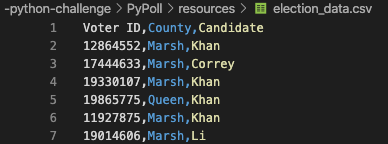

###### by Libardo Lambrano

## Background 

Using python scripting language to complete two real world analytics challenges [PyBank](#pybank) and [PyPoll](#pypoll).

## PyBank 

Creating a Python script for analyzing the financial records of a company. 

> **Given**

A set of financial data `budget_data.csv`. The dataset contains two columns: `Date` and `Profit/Losses`.

> **Tasks**

* Calculate total number of months included in the dataset
* Net total amount of "Profit/Losses" over the entire period
* Average of the changes in "Profit/Losses" over the entire period
* Greatest increase in profits (date and amount) over the entire period
* Greatest decrease in losses (date and amount) over the entire period

> ### Solution 

<ins>Setup</ins>

Import modules, read source file and skip header 

    import os
    import csv

    file = os.path.join('resources', 'budget_data.csv')

    with open(file) as f:
        reader = csv.reader(f, delimiter=',')
        header_row = next(reader)

Generate lists from csv columns and set `counter` for rows at `1`

    months = [] # empty list to store
    profit_loss = [] # empty list to store
    change = []
    c = 1 # counter start

Loop through rows to append data to lists

    for row in reader: 
        months.append(row[0]) # add all months column 0 
        profit_loss.append(int(row[1])) 

<ins>Calculations to answer the following questions</ins> 

* Total number of months included in the dataset

        total_months = len(months)

* Total amount of "Profit/Losses" over the entire period

            for c in range(len(profit_loss)-1): 
            change.append(profit_loss[c+1]-profit_loss[c])

        total_profit_loss = sum(profit_loss)

* Greatest increase in profits (date and amount) over the entire period
* Greatest decrease in losses (date and amount) over the entire period

        max_change = max(change)
        min_change = min(change)
        nmonth_min = change.index(min_change)
        nmonth_max = change.index(max_change)

<ins>Summarizing the results</ins> 

        financial_analysis_summary = (
            'Financial Analysis\n'
            '----------------------------\n'
            f'Total Months: {(total_months)}\n' # or print('Total Months: ' + str(len(months))) 
            f'Total: ${(total_profit_loss)}\n'
            f'Average  Change: ${(avg)}\n'
            f'Greatest Increase in Profits: {months [nmonth_max + 1]} (${max_change})\n'
            f'Greatest Decrease in Profits: {months [nmonth_min + 1]} (${min_change})\n'
        )

<ins>Printing the  results</ins>

        print(financial_analysis_summary)

<ins>Exporting the results</ins> 

        output_file = os.path.join('analysis', 'financial_analysis.txt')

        with open(output_file, 'w') as datafile: 
            datafile.write(financial_analysis_summary)

> ### Final Output

    Financial Analysis
    ----------------------------
    Total Months: 86
    Total: $38382578
    Average  Change: $-2315.12
    Greatest Increase in Profits: Feb-2012 ($1926159)
    Greatest Decrease in Profits: Sep-2013 ($-2196167)

[Back to the top](#top)

## PyPoll 

Creating a Python script for analyzing election results in a small, rural town. 

> **Given**

A set of poll data `election_data.csv`. The dataset contains three columns: `Voter ID`, `County`, and `Candidate`.

> **Tasks**

* Calculate total number of votes cast
* A complete list of candidates who received votes
* The percentage of votes each candidate won
* The total number of votes each candidate won
* The winner of the election based on popular vote

> ### Solution

<ins>Setup

Import modules, create lists from columns, and skip header. Append rows to lists

    import csv
    import os

    from collections import Counter

    file = os.path.join('resources', 'election_data.csv')

    voter_id = []
    country = []
    candidate = []
    c = 1 #counter start

    with open(file) as f:
        reader = csv.reader(f, delimiter=',')
        header_row = next(reader)

        for row in reader:
        voter_id.append(row[0])
        country.append(row[1])
        candidate.append(row[2])

<ins>Calculations to answer the following questions 

* Calculate total number of votes cast

        total_votes = len(voter_id)

* The total and percentage number of votes each candidate won

        candidates = Counter(candidate).keys()
        votes = Counter(candidate)

        'Total Votes : {(total_votes)}'

        for key,value in votes.items():
            '{key}, {value/total_votes:.1%} ({value})'

* The winner of the election based on popular vote

        'Winner: {max(votes, key=votes.get)}'

<ins>Summarizing the results and saving results on a txt file

        # print results 
        print('Election Results')
        print('----------------------------')
        print(f'Total Votes : {(total_votes)}')
        print('----------------------------')
        for key,value in votes.items():
        print(f'{key}, {value/total_votes:.1%} ({value})')
        print('----------------------------')
        print(f'Winner: {max(votes, key=votes.get)}')
        print('----------------------------')

        # export results 
        output_file = os.path.join('analysis', 'election_results.txt')

        with open(output_file, 'w') as datafile: 
        datafile.write('Election Results\n')
        datafile.write('----------------------------\n')
        datafile.write(f'Total Votes : {(total_votes)}\n')
        datafile.write('----------------------------\n')
        for key,value in votes.items():
                datafile.write(f'{key}, {value/total_votes:.1%} ({value})\n')
        datafile.write('----------------------------\n')
        datafile.write(f'Winner: {max(votes, key=votes.get)}\n')
        datafile.write('----------------------------\n')

> ### Final Output

        Election Results
        ----------------------------
        Total Votes : 3521001
        ----------------------------
        Khan, 63.0% (2218231)
        Correy, 20.0% (704200)
        Li, 14.0% (492940)
        O'Tooley, 3.0% (105630)
        ----------------------------
        Winner: Khan
        ----------------------------

[Back to the top](#top)

